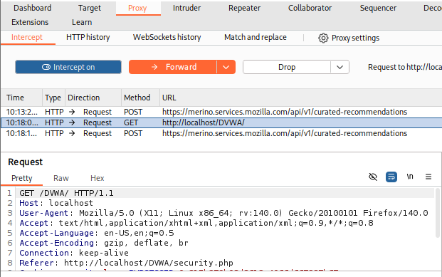
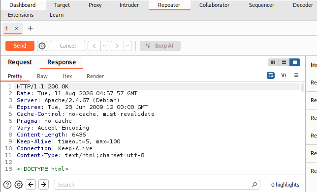
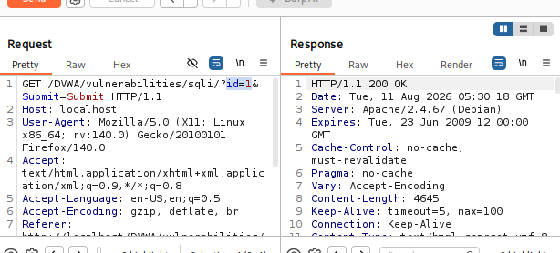
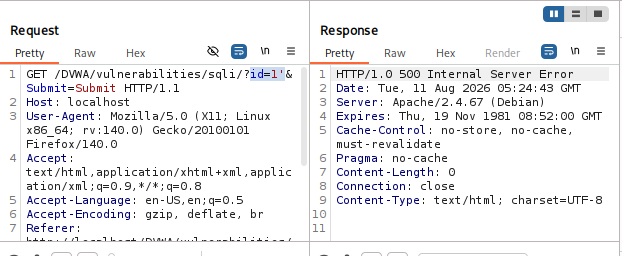
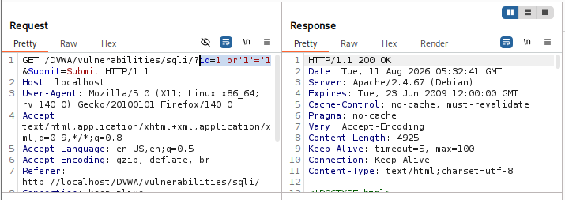
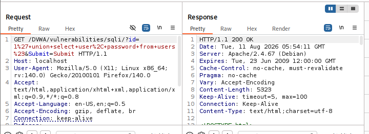

# Web Application Security Assessment using DVWA & Burp Suite

## Overview

This project demonstrates a manual web application security assessment performed against **DVWA (Damn Vulnerable Web Application)** using **Burp Suite Community Edition** in a Kali Linux lab environment.

## Burp Proxy Interception

Burp Suite was configured as an intercepting proxy to capture HTTP requests before they reached the DVWA application.

## Burp Repeater Analysis

Captured requests were forwarded to Burp Repeater to perform controlled parameter manipulation and observe server responses.

## SQL Injection Testing

### Baseline Request

A normal request using `id=1` returned a single valid user record and was used as the baseline for comparison.

### Malformed Input Test

**Payload:** `1'`

**Observation:**

* Application returned **HTTP 500 Internal Server Error**
* Indicates that unsanitized input reached the backend SQL query and caused a server-side failure.

### Boolean-based SQL Injection

**Payload:** `1' OR '1'='1`

**Observation:**

* Returned multiple user records
* Demonstrated successful SQL Injection through parameter manipulation.

### UNION-based SQL Injection

**Payload:** `1' UNION SELECT user,password FROM users#`

**Observation:**

* Extracted usernames and password hashes from the backend database
* Demonstrated successful data retrieval through UNION-based SQL Injection.

## Assessment Findings

* Burp Suite Proxy successfully intercepted HTTP requests.
* Burp Repeater enabled manual parameter manipulation.
* SQL Injection vulnerability was confirmed through malformed input behavior.
* Boolean-based SQL Injection returned multiple database records.
* UNION-based SQL Injection exposed usernames and password hashes from the backend database.

## Report

A detailed assessment report is included in:

`report/DVWA_SQL_Injection_Assessment_Report.pdf`
